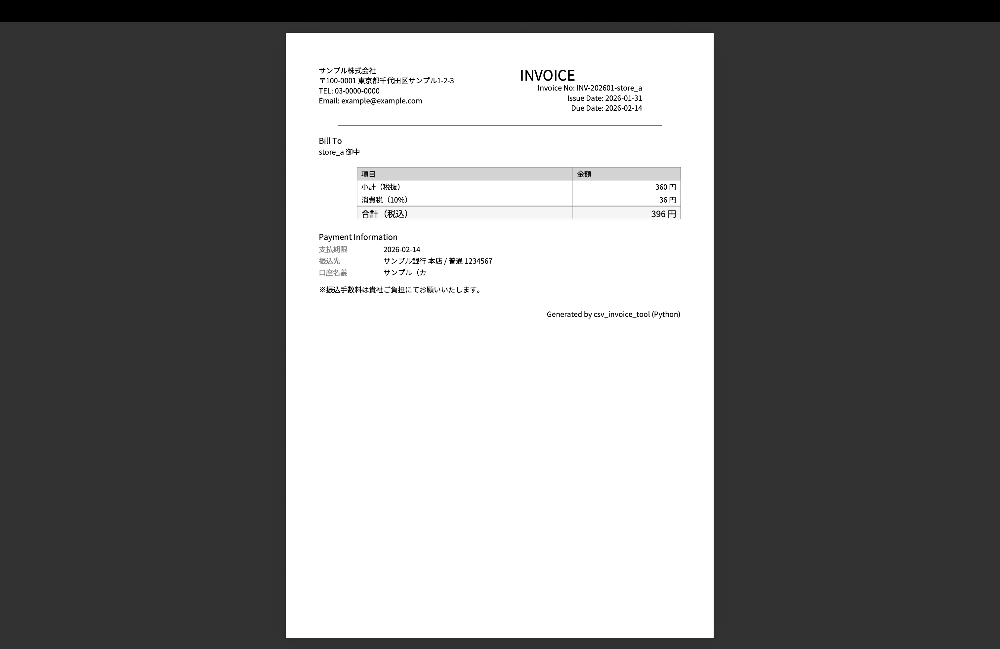

# CSV Invoice Tool

壊れた形式のCSVファイルを自動で正規化・集計し、  
**店舗別の請求書PDFを自動生成する Python ツール**です。

CSVの列順や項目名が統一されていない環境でも動作し、  
業務・副業での利用を想定した構成になっています。

---

## 想定ユースケース

- 複数店舗の売上CSVをまとめて処理したい事業者
- フォーマットが統一されていないCSVを扱う現場
- 毎月の請求書作成を自動化したい小規模事業者
- 請求書作成の属人化をなくしたいケース

---

## 主な機能

- 壊れたCSV（列順・項目名が異なる）を読み込み・正規化
- エラー行と正常行の自動分離
- 店舗別の売上集計
- 日本語対応の請求書PDFを自動生成
- ロゴ・会社情報・銀行情報の差し替えに対応

---

## 出力例

以下のような請求書PDFが自動生成されます。  
（※ サンプルCSVから生成したイメージです）



---

## セットアップ

必要なライブラリをインストールします。

```bash
pip3 install -r requirements.txt
```

---

## 使い方

### 1. CSVを配置

`input/` フォルダに売上CSVファイルを配置します。
CSVの列順や項目名が多少異なっていても処理可能です。

```text
input/
├── store_a_2026_01.csv
├── store_b_2026_01.csv
└── store_c_2026_01.csv
```

### 2. 実行

プロジェクトのルートディレクトリで、以下のコマンドを実行します。

```bash
python3 -m src.main --month 2026-01
```

3. 出力確認（結果）

実行後、以下のファイルが自動生成されます。

```text
output/
├── normalized.csv        # 正規化後のデータ
├── errors.csv            # エラー行のみをまとめたCSV
└── invoices/
    ├── invoice_store_a_202601.pdf
    ├── invoice_store_b_202601.pdf
    └── invoice_store_c_202601.pdf
```

output/invoices/ フォルダ内に、
店舗ごとの請求書PDFが出力されます。

---

##　設定変更について

会社名・住所・ロゴ・銀行情報などは
src/config.py を編集することで変更できます。

コードのロジックを修正する必要はありません。

---

## 対応できる案件例（副業想定）

本ツールは、以下のような業務・副業案件を想定して設計しています。

- 店舗別・拠点別の売上CSVを集計し、請求書を自動生成する案件
- フォーマットが統一されていないCSVを扱う集計業務の自動化
- 毎月発生する請求書作成業務の省力化・自動化
- Excel手作業で行っている集計処理のPython化
- 既存CSV仕様に合わせた正規化ルールの追加・調整

案件ごとに発生しやすい「CSVの揺れ」や「例外行」を考慮した設計になっています。

---

## 技術的なポイント

- 入力CSVの列順・列名の違いを吸収する正規化処理
- 不正データ（空欄・数値不正など）をエラー行として分離
- 集計処理・PDF生成処理を責務ごとに分離した設計
- 設定変更（会社情報・銀行情報・ロゴ）は config.py に集約
- 実データを含めず、サンプルデータで検証可能な構成

---

## 設計の考え方（Design Rationale）

本ツールは、実際の業務や副業案件で発生しやすい
「CSVの揺れ」「例外データ」「仕様変更」を前提に設計しています。

### なぜ「正規化 → 集計」という2段階構成にしているのか

CSVを直接集計せず、  
**一度「正規化」という共通フォーマットに変換してから集計**する構成にしています。

これにより、

- CSVの列順・列名が異なっても処理を共通化できる
- 将来CSV仕様が増えても、正規化ロジックを追加するだけで対応可能
- 集計・PDF生成処理をシンプルに保てる

といったメリットがあり、  
**自動化・保守・拡張がしやすい構成**になっています。

---

### なぜ会社情報・銀行情報を `config.py` に切り出しているのか

会社名・住所・ロゴ・銀行口座などは、
案件やクライアントごとに変更が発生しやすい要素です。

そのため、

- コードのロジックを触らずに設定変更できる
- 非エンジニアでも差し替えが可能
- 案件対応時の修正ミスを防げる

ように、設定情報を `config.py` に集約しています。

**「設定変更だけで使い回せるツール」** を意識した設計です。

---

### なぜエラー行を削除せず `errors.csv` として出力しているのか

業務では、

- 数値が空欄
- 文字列が混入
- 一部の行だけ形式が違う

といった **「完全には捨てられないデータ」** が頻繁に発生します。

本ツールではエラー行を破棄せず、

- どの行が
- なぜエラーになったのか

を `errors.csv` として出力することで、

- 後から人が修正できる
- 元データの確認・証跡を残せる
- 処理を止めずに先へ進める

といった、**実務向けの運用を想定**しています。